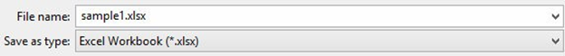

第一章

# 第一章

入门

我们需要从这里开始入门指南。

## 1.1加载您的数据

Orange自带数据格式，但也可以处理原生的Excel、逗号或标签分隔的数据文件。输入的数据集通常是一个表，行中有数据实例（样本），列中有数据属性。属性可以是不同的类型（数字、分类、日期时间和文本），并有指定的角色（输入特征、元属性和类）。数据属性类型和角色可以在数据表头中提供。它们也可以在"文件"小组件中改变，而数据角色也可以通过"选择列"小组件来修改。

### 1.1.1 简述

• Orange可以导入任何逗号或制表符分隔的数据文件，或Excel的本地文件或Google Sheets文档。使用"文件"小组件来加载数据，如果需要的话，可以定义类和元属性。
• 可以在"文件"小组件中设置类型和角色。
• 列头中的属性名可以在前面加一个标签，后面加一个哈希。用c表示类，m表示元属性，i表示忽略列，w表示权重列，C、D、T、S表示连续、离散、时间和字符串属性类型。示例：C#mph，mS#name。C#mph, mS#name, i#dummy.
• 哈希符号的替代方法是Orange的原生格式，有三个头行：第一行是属性名，第二行指定类型（连续、离散、时间或字符串），第三行证明属性作用的信息（类、元、权重或忽略）。

### 1.1.2 Excel中的数据

以下是在Excel中输入的一个数据集示例（sample.xlsx）。


该文件包含一个标题行、8个数据实例（行）和7个数据属性（列）。表中的空单元格表示缺少数据条目。行代表基因；它们的功能（类）在第一列提供，它们的名称在第二列提供。剩下的列存储了表征每个基因的测量值。有了这些数据，我们可以，比如说，开发一个分类器，根据其特征测量来预测基因功能。
让我们从一个简单的工作流程开始，读取数据并将其显示在表格中。


要加载数据，请打开"文件"小组件（双击小组件的图标），点击文件浏览器图标（"..."），并在磁盘上找到下载的文件（称为 sample.xlsx）。


***文件小部件。设置属性类型和角色***

文件"小组件将数据发送到"数据表"。双击"数据表"可查看其内容。


Orange假设了有基因名的一列是元信息，在数据表中以浅褐色阴影的列显示。它没有猜到我们数据文件中的第一个非元列--function是一个类列。要想在橙子中纠正这个问题，我们可以在文件小组件的列显示中调整属性作用（如下图）。双击函数行中的特征标签，选择目标代替。这样就会将函数属性设置为我们的目标（类）变量。


你也可以将属性类型从名义型改为数字型，从字符串型改为日期时间型，等等。当然，数据值必须适合指定的属性类型。Datetime只接受ISO 8601格式的值，比如2016-01-01 16:16:01。如果属性有几个不同的值，橘子君也会认为该属性是数字型的，否则会认为是名义型的。其他类型都被认为是字符串，因此自动归类为元属性。
属性角色和类型的更改应通过点击"应用"按钮来确认。

***选择列。设置属性角色***

设置数据角色的另一种方法是将数据馈送到"选择列"小组件。


打开选择列，可以看到Orange对属性的分类。我们希望我们所有的连续属性都是数据特征，基因功能是我们的目标变量，基因名称视为元属性。我们可以通过在Select Columns的方框内拖动属性名来获得。


要正确地重新分配属性类型，请将名为函数的属性拖到"类"框中，将名为基因的属性拖到"元属性"框中。现在，"选择列"小组件应该是这样的。


选择列小组件中属性类型的更改应通过单击应用按钮来确认。来自该小组件的数据被输入到数据表中，现在数据表会按照我们预期的方式呈现数据。


我们也可以用不同的方式定义这个数据集的域。比如，我们可以让数据集为回归做好准备，并将热0作为连续类变量，保留基因功能和名称作为元变量，并从数据集中删除heat10和heat20。


通过如上设置属性，数据表小组件中的数据渲染会给出以下输出。


### 1.1.3 带有属性类型信息的标头。

再次考虑sample.xlsx数据集。这次我们将用定义属性类型(连续、离散、时间、字符串)和角色(类或元属性)的前缀来增强属性名称。前缀与属性名之间用哈希符号（"#"）隔开。属性角色的前缀是：
• c：类属性
• m：元属性
• i：忽略属性
• w：实例权重，对于类型。
• C：连续
• D：离散型
• T：时间
• S: 字符串
这是Excel中带有增强属性名的页眉的样子（sample-head.xlsx）。


我们可以再次使用File widget来加载这个数据集，然后在数据表中呈现。


注意，我们忽略的属性（属性名中的标签"i"）在数据集中并不存在。


### 1.1.4 三行标题格式

Orange的传统本地数据格式是一个以制表符分隔的文本文件，有三个标题行。第一行列出了属性名称，第二行定义了它们的类型（连续、离散、时间和字符串，或缩写为c、d、t和s），第三行是可选的角色（类、元、权重或忽略）。下面是一个例子。


### 1.1.5 来自Google Sheets的数据

Orange可以从Google Sheets中读取数据，只要它符合我们上面介绍的数据呈现规则。在Google Sheets中，复制可共享链接（共享按钮，然后获取可共享链接），并将其粘贴在文件小组件的数据文件/URL框中。尝尝看，这里有一个这样的链接，你可以使用：http://bit.ly/1J12Tdp 以及我们在文件小组件中输入它的方式。


### 1.1.6 LibreOffice的数据

如果您使用LibreOffice，只需将您的文件保存为Excel (.xlsx)格式（在"另存为"类型下的下拉菜单中提供）。



### 1.1.7 数据时间格式

为了避免歧义，Orange支持以ISO 8601格式之一格式化的日期和/或时间。例如，以下数值都是有效的。

```
2016
2016-12-27
2016-12-27 14:20:51
16:20
```


