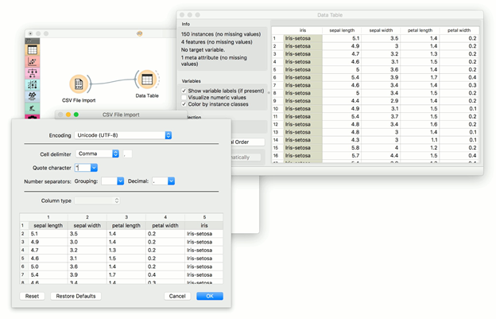
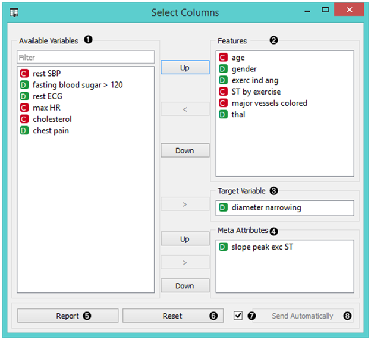
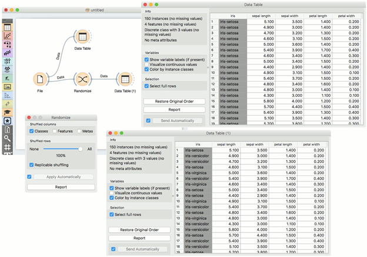
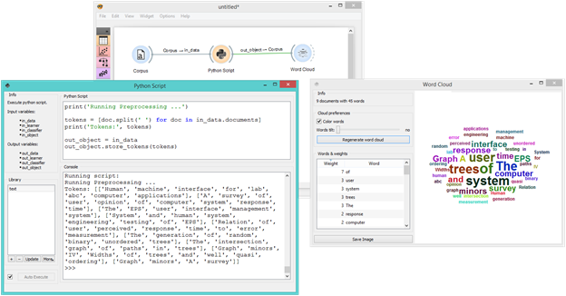
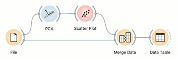

第二章

# 第二章

# 小工具

## 2.1 数据

### 2.1.1 文件

从输入文件中读取属性值数据。

产出

- 数据：文件中的数据集
	
文件小组件读取输入数据文件（带有数据实例的数据表）并将数据集发送到其输出通道。最近打开的文件的历史记录被保存在小组件中。该小组件还包括一个包含Orange预装的样本数据集的目录。

小工具从 Excel (.xlsx)、简单的制表符分隔 (.txt)、逗号分隔的文件 (.csv) 或 URL 读取数据。对于其他格式，请参见下面的"其他格式"部分。


1.	浏览以前打开的数据文件，或加载任何一个样本文件。
2.	浏览一个数据文件。
3.	重载当前选择的数据文件。
4.	插入来自URL地址的数据，包括来自Google Sheets的数据。
5.	关于加载的数据集的信息：数据集大小、数据特征的数量和类型。
6.	数据集中特征的附加信息。可以通过双击特征来编辑它们。用户可以更改属性名称，选择每个属性的变量类型（连续、名义、字符串、日期时间），并选择如何进一步定义属性（作为特征、目标或元）。用户还可以决定忽略某个属性。
7.	浏览文档数据集。
8.	编写一份报告。

**例子**

大多数Orange工作流程可能会从文件小组件开始。在下面的模式中，该小组件用于读取发送到数据表和框图小组件的数据。


**加载您的数据**

- Orange可以导入任何逗号、.xlsx或制表符分隔的数据文件或URL。使用"文件"小组件，然后，如果需要，选择类和元属性。
- 为了指定属性的域和类型，属性名前面可以加一个标签，后面加一个哈希。用c表示类，用m表示元属性，用i表示忽略一列，用C、D、S表示连续、离散和字符串属性类型。示例：C#mpg，mS#name。C#mpg, mS#name, i#dummy.
- Orange的原生格式是一个以标签分隔的文本文件，有三行标题。第一行包含属性名，第二行包含类型（连续、离散或字符串），第三行包含可选元素（类、元或时间）。


在此阅读更多关于加载数据的内容。

其他格式

支持的格式和加载它们的小工具。

- 距离矩阵。距离文件
- 预测模型。负载模型
- 网络。网络文件来自网络附加组件
- 图像。从图像分析插件导入图像
- text/corpus。语料库或从文本导入文件附加组件
- 单元格数据。从单细胞加载数据附加组件
- 几个光谱文件。多文件从光谱学附加组件

### 2.1.2 CSV文件导入

从CSV格式的文件导入数据表。

产出

- 数据：来自.csv文件的数据集。
- 数据框：pandas DataFrame对象。

CSV 文件导入小组件读取以逗号分隔的文件并将数据集发送到其输出通道。文件分隔符可以是逗号、分号、空格、制表符或手动定义的定界符。最近打开的文件的历史记录会被保存在小组件中。

数据框输出可以通过连接到in_object输入(例如df = in_object)，在Python脚本小组件中使用。然后就可以使用一个常规的DataFrame。

**导入选项**

用户设置导入参数的导入窗口。可通过按小组件中的导入选项重新打开。
右键点击列名，设置列的类型。右键点击行索引（在左侧），将某行标记为页眉、跳过或普通数据行。


1.	文件编码。默认为UTF-8。详见编码子章。
2.	导入设置。
•	单元分隔符：
–	标签
–	逗号
–	分号
–	空间
–	其他（将字段中的定界符设置在右边）。
•	引用字符："或'。定义什么是文本。
•	号码分离器。
–	分组：千人的定界符，如1,000人。
–	小数：小数的定界符，如1.234。
3.	列类型：在预览中选择列并设置其类型。也可以通过右击所选列来设置列类型。
•	自动：Orange将自动尝试确定列类型。(默认)
•	数值：适用于连续数据类型，例如(1.23、1.32、1.42、1.32)
•	分类：用于离散数据类型，例如（棕色、绿色、蓝色）。
•	文本：用于字符串数据类型，例如（John、Olivia、Mike、Jane）。
•	Datetime：对于时间变量，例如：(1970-01-01)
•	忽略：不输出该列。
4.	按"重置"将把设置返回到先前的设置状态（在"导入选项"对话框中按"确定"保存）。恢复默认值将设置为其默认值。取消将中止导入，而确定将导入数据并保存设置。

**小工具**

数据成功导入后的小部件。


1.	文件夹图标会打开导入本地.csv文件的对话框，它可以用来加载第一个文件或更改现有文件（加载新数据）。它可用于加载第一个文件或更改现有文件（加载新数据）。文件"下拉菜单中存储了以前加载的数据集的路径。
2.	关于导入的数据集的信息。报告实例（行）、变量（特征或列）和元变量（特殊列）的数量。
3.	导入选项重新打开导入对话框，用户可以设置定界符、编码、文本字段等。取消中止数据导入。重新加载再次导入文件，将原始文件中的任何更改添加到数据中。

**编码**

在"导入选项 - 编码"下拉菜单中设置自定义编码列表的对话。选择"自定义编码列表..."来更改列表中出现的编码。要保存更改，只需关闭对话。关闭并重新打开 Orange（即使有重置小组件设置）也不会重新设置列表。要做到这一点，请按"恢复默认值"。要在列表中显示所有可用的编码，请按选择所有。


**例子**

CSV 文件导入的工作方式与文件小组件几乎完全相同，增加了导入不同类型的 .csv 文件的选项。在此工作流程中，小组件从文件中读取数据并将其发送到数据表中进行检查。



### 2.1.3 数据集

从在线存储库中加载一个数据集。

产出

- 数据：输出数据集
数据集部件从服务器上检索所选的数据集并将其发送到输出。文件被下载到本地内存，因此即使没有互联网连接也可以立即使用。每个数据集都有一个描述和数据大小、实例数、变量数、目标和标签的信息。


1.	关于可用数据集的数量和下载到本地存储器的数量的信息。
2.	现有数据集的内容。每个数据集的大小、实例和变量的数量、目标变量的类型和标签都有描述。
3.	对所选数据集的正式说明。
4.	如果勾选"自动发送数据"，则所选的数据集将自动进行通信。或者，按"发送数据"。

**例子**

Orange工作流可以用Datasets小组件而不是File小组件开始。在下面的例子中，该小组件从在线存储库中检索一个数据集（Kickstarter数据），该数据集随后被发送到数据表和数据集。

分布：


### 2.1.4 SQL表

从SQL数据库中读取数据。

产出

- 数据：数据库中的数据集

SQL小工具可以访问存储在SQL数据库中的数据，它可以连接PostgreSQL（需要psycopg2模块）或SQL Server（需要pymssql模块）。它可以连接到PostgreSQL（需要psycopg2模块）或SQL Server（需要pymssql模块）。

为了处理大型数据库，Orange尝试在数据库本身执行部分计算，而不下载数据。这只适用于PostgreSQL数据库，需要在服务器上安装量化和tsm_system_time扩展。如果没有安装这些扩展，数据将被下载到本地。


1.	数据库类型（可以是PostgreSQL或MSSQL）。
2.	主机名称：
3.	数据库名称：
4.	用户名：
5.	密码。
6.	按蓝色按钮连接到数据库。然后在下拉菜单中选择表。
7.	自动发现分类变量将把少于20个不同值的INT和CHAR列投为分类变量（在大型表格中查找所有不同值可能会很慢）。如果没有选择，INT将被视为数字，CHAR将被视为文本。下载到本地内存 将选定的表下载到本地机器上。

##安装说明
###PostgreSQL 安装后台。

`pip install psycopg2
`

另外，你也可以按照这些说明来安装后台。

安装扩展程序。[可选]
###MSSQL
安装后台。

`pip install pymssql`

如果您遇到问题，请按照以下说明进行操作。

##示例

下面是一个关于如何使用 SQL 表小组件的简单示例。将小组件放在画布上，输入您的数据库凭证并连接到您的数据库。然后选择你想分析的表。

将SQL表连接到数据表小组件以检查输出。如果表已被填充，则说明您的数据已正确传输。现在，您可以以与文件小组件相同的方式使用 SQL 表小组件。


### 2.1.5 保存数据

将数据保存到文件中。

输入

- 数据：输入数据集

保存数据小组件考虑输入通道中提供的数据集，并将其保存到具有指定名称的数据文件中。它可以将数据保存为以制表符分隔或以逗号分隔的文件。

小组件不会在每次接收到输入的新信号时保存数据，因为这将不断地（而且大多是无意中）覆盖文件。相反，只有在设置了新的文件名或用户按下"保存"按钮后，才会保存数据。

如果文件被保存到与工作流相同的目录或该目录的子树中，小组件会记住相对路径。否则，它将存储一个绝对路径，但出于安全原因，禁用自动保存。


1.	通过覆盖现有文件来保存。
2.	另存为创建一个新文件。

**例子**

在下面的工作流程中，我们使用了动物园数据集。我们将数据加载到散点图小组件中，用它选择数据实例的一个子集，并将它们推送到保存数据小组件，将它们存储在文件中。


### 2.1.6 数据信息

显示所选数据集的信息。

输入

- 数据：输入数据集

一个简单的小部件，可以显示数据集大小、特征、目标、元属性和位置的信息。


1. 关于数据集大小的信息
2. 关于离散和连续特征的信息
3. 关于目标的信息
4. 元属性的信息 
5. 数据存储位置的信息
6. 编写一份报告。

**例子**

下面，我们比较了两个数据信息小组件的基本统计数据--一个是整个数据集的信息，另一个是散点图小组件中（手动）选择的子集的信息。我们使用的是Iris数据集。


### 2.1.7 数据表

在电子表格中显示属性值数据。

输入

- 数据：输入数据集

产出

- 选择的数据：从表中选择的实例

数据表小组件在其输入中接收一个或多个数据集，并以电子表格的形式呈现。数据实例可按属性值排序。该小组件还支持手动选择数据实例。


1.	数据集的名称（通常是输入数据文件）。数据实例以行为单位，其属性值以列为单位。在这个例子中，数据集是按属性"萼片长度"排序的。
2.	当前数据集的大小和属性的数量和类型的信息。
3.	连续属性的值可以用条形图可视化；颜色可以归属于不同的类别。
4.	可以选择数据实例（行）并将其发送到小组件的输出通道。
5.	使用"恢复原始顺序"按钮，在基于属性的排序之后，重新排列数据实例。
6.	编写一份报告。
7.	当自动发送开启时，所有更改将自动传达给其他小组件。否则，请按发送所选行。

**例子**

我们使用了两个 File widget 来读取 Iris 和 Glass 数据集（在 Orange 发行版中提供），并将它们发送到数据表 widget。


第一个数据表中选择的数据实例被传递到第二个数据表。注意，我们可以选择要查看的数据集（虹膜或玻璃）。如果选择了Commit on any change，从一个数据集改变到另一个数据集，会改变数据实例的通信选择。


### 2.1.8 选择列

手动选择数据属性和数据域的构成。

输入

- 数据：输入数据集

产出

- 数据：带有小组件中设置的列的数据集。

选择列小组件用于手动组成你的数据域。用户可以决定使用哪些属性以及如何使用。Orange区分了普通属性、（可选）类属性和元属性。例如，对于构建分类模型，域将由一组属性和一个离散的类属性组成。元属性不用于建模，但若干小组件可以使用它们作为实例标签。

Orange属性有一个类型，可以是离散的，也可以是连续的，还可以是字符串。属性类型用出现在属性名称前的符号标示（分别为D、C、S）。



1.	输出数据文件中不会出现的遗漏数据属性。
2.	新数据文件中的数据属性
3.	目标变量，如果没有，新数据集将没有目标变量。如果没有，新数据集将没有目标变量。
4.	新数据文件的元属性。这些属性包含在数据集中，但对于大多数方法来说，在分析中并不考虑。
5.	编写一份报告。
6.	将域的构成重置为输入数据文件的构成。
7.	如果你想自动应用数据域的变化，请打勾。
8.	应用数据域的变化，并将新的数据文件发送到小组件的输出通道。

**例子**

在下面的工作流程中，来自"文件"小组件的 Iris 数据被送入"选择列"小组件，我们选择只输出两个属性（即花瓣宽度和花瓣长度）。我们在数据表小组件中查看原始数据集和带有选择列的数据集。


为了更复杂地使用这个小工具，我们组成了一个工作流来重新定义 heartdisease 数据集中的分类问题。最初，任务是预测患者是否有冠状动脉直径狭窄。我们根据年龄、胸痛和胆固醇水平，将问题改为性别分类，并信息化地保留了直径狭窄作为元属性。


### 2.1.9 选择行

根据条件在数据特征上选择数据实例。

输入

- 数据：输入数据集

产出

- 匹配数据：符合条件的实例。
- 非匹配数据：不符合条件的实例。
- 数据：数据中多了一列，显示是否选择了一个实例。

此小组件根据用户定义的条件，从输入数据集中选择一个子集。匹配选择规则的实例被放置在输出匹配数据通道中。
数据选择的标准是以一组共轭术语的形式呈现的（即被选中的项目符合"条件"中的所有术语）。

条件项是通过选择一个属性，从操作符列表中选择一个操作符来定义的，如果需要，还可以定义条件项中使用的值。离散属性、连续属性和字符串属性的运算符是不同的。


1.	你想应用的条件，它们的操作者和相关的值。
2.	在条件列表中添加一个新条件。
3.	一次添加所有可能的变量。
4.	一次性删除所有列出的变量。
5.	关于输入数据集的信息和符合条件的实例的信息
6.	清理输出数据。
7.	当勾选自动发送框时，所有更改将自动传达给其他小组件。
8.	编写一份报告。

条件构成的任何变化都会更新信息窗格（数据输出）。

如果选择了自动发送，那么在条件的组成或其任何条款发生变化时，输出将被更新。

**例子**

在下面的工作流程中，我们使用"文件"小组件中的动物园数据，并将其送入"选择行"小组件。在小组件中，我们选择只输出两种动物类型，即鱼类和爬行动物。我们可以在数据表小组件中检查原始数据集和带有选择行的数据集。


在下一个例子中，我们使用泰坦尼克号数据集的数据，并同样将其送入Box Plot小组件中。我们首先根据生存率观察整个数据集。然后，我们在"选择行"小组件中只选择了头等舱乘客，并再次将其送入"盒状图"。在那里，我们可以看到所有头等舱乘客按其生存率列出，并按性别分组。


### 2.1.10 数据采样器

从输入数据集中选择一个数据实例的子集。

输入

- 数据：输入数据集

产出

- 数据样本：采样数据实例
- 剩余数据：样本外数据

数据采样器小组件实现了几种数据采样方法。它输出一个采样数据集和一个互补数据集（包含不包含在采样数据集中的输入集实例）。在提供输入数据集并按下"采样数据"后，输出将被处理。


1.	输入和输出数据集的信息。
2.	(a) 所需的抽样方法；
- 固定比例的数据返回整个数据的一个选定的百分比（例如，所有数据的70%）。
- 固定样本大小返回选定数量的数据实例，有机会设置替换样本，它总是从整个数据集中采样（不减去子集中已有的实例）。使用替换，你可以生成比输入数据集中可用的更多实例。
- 交叉验证将数据实例分割成指定数量的互补子集。按照典型的验证模式，除了用户选择的子集外，所有的子集都作为数据样本输出，而被选择的子集则进入剩余数据。注意：在旧版本中，输出被调换。如果小组件是从旧工作流加载的，则会切换到兼容性模式）。)
- Bootstrap从人口统计中推导出样本。
3.	可复制的抽样保持了可以跨用户的抽样模式，而分层抽样则模拟了输入数据集的构成。
4.	按采样数据键，输出数据样本。

如果选择了所有的数据实例（通过将比例设置为100%或将固定样本大小设置为整个数据大小），输出实例仍然会被洗牌。

**例子**

首先，我们来看看数据采样器是如何工作的。我们将使用文件小组件中的虹膜数据。我们看到数据中有150个实例。我们使用数据采样器小组件对数据进行采样，为了简单起见，我们选择了5个实例的固定样本大小。我们可以在数据表小组件（Data Table (in-sample)）中观察采样数据。第二个数据表（Data Table (out-of-sample)）显示了剩余的145个不在样本中的实例。要输出样本外数据，请双击小组件之间的连接，并将输出重新连接到剩余数据 -> 数据。


现在，我们将使用数据采样器将数据分为训练和测试部分。我们使用的是虹膜数据，是用文件部件加载的。在Data Sampler中，我们用固定比例的数据来分割数据，在样本中保留70%的数据实例。

然后，我们将两个输出连接到测试和分数小组件，数据样本->数据和剩余数据->测试数据。最后，我们添加Logistic回归作为学习者。这将在数据输入上运行逻辑回归，并在测试数据上评估结果。


**取样过量/过少**

数据采样器也可以用来对数据中的少数群体进行过度采样或对多数群体进行不足采样。让我们展示一个过采样的例子。首先，使用"选择行"小组件来分离少数派类。我们使用的是文件小组件中的虹膜数据。该数据集有 150 个数据实例，每个类有 50 个。让我们进行过采样，比如说，虹膜-setosa。

在选择行中，将条件设置为iris是iris-setosa。这将输出50个iris-setosa类的实例。现在，将 Matching Data 连接到数据采样器中，选择固定样本大小，将其设置为例如 100，然后选择 Sample with replacement。按下数据采样器后，小组件将输出 100 个 iris-setosa 类的实例，其中一些将被重复（因为我们使用了替换采样）。

最后，使用 Concatenate 加入过采样实例和选择行小组件的未匹配数据输出。这样就会输出一个有200个实例的数据集。我们可以在 Distributions 中观察最终的结果。


### 2.1.11 转置

转置一个数据表。

输入

- 数据：输入数据集

产出

- 数据：转置数据集 转置小组件转置数据表。


**例子**

这是一个简单的工作流程，展示如何使用Transpose。将小组件连接到文件小组件。Transpose 的输出是一个转置的数据表，行为列，列为行。您可以在数据表中观察结果。


2.1.12 Discretize

将输入数据集的连续属性分解。

输入

- 数据：输入数据集

产出

- 数据：带有离散值的数据集。

Discretize 小组件用选定的方法对连续属性进行分解。


1.	小工具的基本版本相当简单。它允许在三种不同的离散化之间进行选择。
- 由Fayyad和Irani发明的Entropy-MDL是一种自上而下的离散化，它在切割处递归地分割属性，使信息增益最大化，直到增益低于切割的最小描述长度。这种离散可以产生任意数量的区间，包括单一区间，在这种情况下，该属性被视为无用（删除）而被丢弃。
- 等频将属性分割成给定数量的区间，因此每个区间包含的实例数量大致相同。
- 等宽度均匀地分割最小和最大观测值之间的范围。间隔数可以手动设置。
- 小组件还可以设置为使属性连续或删除它们。
2.	要单独处理属性，请转到"单个属性设置"。它们显示了每个属性的特定离散化，并允许更改。首先，左上方的列表显示了每个属性的截止点。在快照中，我们使用了熵-MDL离散化，它可以自动确定最佳的区间数，我们可以看到它把年龄离散成了7个区间，截止点分别是21.50、23.50、27.50、35.50、43.50、54.50和61.50，而资本收益则被分成了很多区间，有几个截止点。例如，最后的权重（fnlwgt）就只剩下一个区间，因此被删除。在右边，我们可以为每个属性选择一个特定的离散化方法。属性"fnlwgt"会被基于MDL的微分法删除，所以为了防止其被删除，我们选择该属性，并选择例如等频微分法。我们也可以选择让该属性保持连续。
3.	编写一份报告。
4.	勾选自动应用，以便小组件自动提交更改。或者，按"应用"。

**例子**

在下面的模式中，我们展示了具有连续属性（如原始数据文件）和差异化属性的Iris数据集。


### 2.1.13 Continuize

将离散变量（属性）转化为数字（"连续"）虚拟变量。

输入

- 数据：输入数据集

产出

- 数据：转换后的数据集

Continuize小组件接收输入中的数据集并输出相同的数据集，其中离散变量（包括二进制变量）被替换为连续变量。


1.	定义非二元分类变量的处理方法。
本节的例子将假设我们有一个离散的属性状态，其值依次为低、中、高。其转换的选项有：
- 第一个值为基值：一个N值的分类变量将被转化为N-1个数字变量，每个变量作为除基值外的一个原始值的指标。基值是列表中的第一个值。默认情况下，值按字母顺序排列；它们的顺序可以在"编辑域"中更改。
在上面的案例中，将三值变量status转化为两个数字变量，status=middle，其值为0或1，表示原变量在某一实例上是否有值中间，同样，status=high。
- 最频繁的值作为基数：与上面类似，只是将最频繁的值作为基数。所以，如果上例中最频繁的值是middle，那么就把middle作为基数，新构造的两个变量是state=low和state=high。
- 每个值一个属性：这个选项为原始变量的每个值构造一个数字变量。在上面的例子中，我们将得到变量status=low，status=middle和status=high。
- 忽略多变量属性：从数据中删除非二元分类变量。
- 处理为序数：将变量转换成一个单一的数值变量，列举原始值。在上面的例子中，新变量的值是0代表低，1代表中，2代表高。再次注意，值的顺序可以在编辑域中设置。
- 除以数值的数量：同上，除了数值被归一化为0-1的范围。在我们的例子中，新变量的值是0、0.5和1。
2.	定义连续属性的处理方式。除了"保持原样"选项外，我们还可以按跨度归一化，它将减去数据中的最低值，然后除以跨度，这样所有的值都将适合[0, 1]。选项 Normalize by standard deviation（按标准差归一化）是减去平均值，然后除以标准差。
3.	定义类属性（结果、目标）的处理方式。除了保持原样之外，除了那些将结果拆分为多个结果变量的选项之外，可用的选项也反映了多子属性的选项。
4.	这个选项定义了新变量的范围。在上面的文字中，我们认为范围是从0到1。
5.	编写一份报告。
6.	如果勾选"自动应用"，则更改会自动提交。否则，您必须在每次更改后按"应用"键。

**例子**

首先，我们来看看Continuize小组件的输出是什么。我们将原始数据（心脏疾病数据集）输入数据表，看看它们的样子。然后我们将离散值连续化，并在另一个数据表中观察它们。


在第二个例子中，我们展示了该小组件的典型用途--为了正确绘制数据的线性投影，需要将离散属性转换为连续属性，这就是为什么我们在绘制数据之前将数据通过Continuize小组件的原因。属性"胸痛"原本有四个值，被转化为三个连续属性；性别也是如此，被转化为一个单一属性"gender=female"。


### 2.1.14 创建类

从字符串属性创建类属性。

输入

- 数据：输入数据集

产出

- 数据：带有新类变量的数据集。

创建类从现有的离散或字符串属性创建新的类属性。小组件会匹配所选属性的字符串值，并为匹配的实例构造一个新的用户定义值。


1.	新类的属性是由新类构建的。
2.	匹配。
- 名称：新类值的名称
- 子串：由regex定义的子串，将与上述定义的属性的值相匹配。
- 实例：与子串相匹配的实例数量。
- 按'+'键添加一个新的类值。
3.	新类列的名称。
4.	只在开头匹配将从字符串的开头开始匹配。对大小写敏感也会按大小写进行匹配。
5.	编写一份报告。
6.	按"应用"键提交结果。

**例子**

下面是一个简单的自动mpg数据集的例子。将数据传递给Create Class。选择car_name作为创建新类的列。这里，我们希望创建与汽车品牌相匹配的新值。首先，我们键入 ford 作为匹配字符串的新值。然后，我们定义匹配数据实例的子串。这意味着，所有在car_name中包含ford的实例，现在都将在新的类列中拥有一个值ford。接下来，我们为honda和Fiat定义同样的内容。小组件会告诉我们有多少实例尚未匹配（剩余实例）。我们将把它们命名为其他，但你可以通过添加一个带'+'的条件继续创建新的值。

我们将我们的新类列命名为car_brand，我们在字符串的开头进行匹配。


最后，我们可以在数据表中观察新列，或者在散点图中使用该值作为颜色。

### 2.1.15 随机化

对输入数据集的类、属性和/或元进行重组。

输入

- 数据：输入数据集

产出

- 数据：随机数据集

随机化小组件在输入中接收一个数据集，并输出相同的数据集，其中的类、属性或/和元被洗牌。


1.	选择你想洗牌的数据集的列组。
2.	选择你要洗牌的数据集的比例。
3.	产生可复制的产出。
4.	如果勾选"自动应用"，则更改会自动提交。否则，您必须在每次更改后按"应用"键。
5.	编写一份报告。

**例子**

随机化小组件通常放置在文件小组件之后（例如：文件小组件）。基本的使用方法如下面的工作流程所示，其中Iris数据集的类变量的值被随机洗牌。



在接下来的例子中，我们展示了在上面相同的数据集上，洗牌类值是如何影响模型性能的。


### 2.1.16 连接

连接多个来源的数据。

输入

- 主要数据：定义属性集的数据集。
- 附加数据：附加数据集

产出

- 数据：连接数据

小组件将多组实例（数据集）合并。合并是"垂直"的，也就是说，10和5个实例的两个集合产生了一个新的15个实例的集合。


1.	设置属性合并方式。
2.	将源数据集的标识添加到输出数据集中。
3.	编写一份报告。
4.	如果勾选"自动应用"，则会自动传达更改。否则，请单击"应用"。

如果其中一个表作为主表连接到小组件，则生成的表将包含自己的属性。

如果没有主表，属性可以是指定为附加表的表中出现的所有属性的联合，也可以是它们的交集，也就是所有连接表的共同属性列表。

**例子**

如下图所示，该小组件可用于合并来自两个独立文件的数据。假设我们有两个属性相同的数据集，一个包含来自第一个实验的实例，另一个包含来自第二个实验的实例，我们希望将两个数据表合并在一起。我们使用 Concatenate 小组件按属性合并数据集（在现有属性下追加新行）。

下面，我们使用了一个修改后的动物园数据集。在第一个File小组件中，我们只加载了字母A和B开头的动物，而在第二个File小组件中，我们只加载了字母C开头的动物，连接后，我们在Data Table小组件中观察到了新的数据，我们看到了从A到C的完整的动物表。


### 2.1.17 按数据指数选择

通过数据子集的索引匹配实例。

输入

- 数据：参考数据集
- 数据子集：要匹配的子集

产出

- 匹配数据：来自参考数据集的子集，与子集数据的指数相匹配。
- 未匹配数据：来自参考数据集的子集与子集数据的指数不匹配。
- 附加说明的数据：参考数据集，附加一列定义匹配的数据。

通过数据索引选择可以按索引匹配数据。数据集中的每一行都有一个索引，给定一个子集，这个小组件可以将这些索引与参考数据的索引进行匹配。大多数情况下，它用于从转换数据中检索原始数据（例如，从 PCA 空间）。


1.	关于参考数据集的信息。该数据被用作索引参考。
2.	关于数据子集的信息。该数据集的指数用于查找参考数据集中的匹配数据。默认情况下，匹配数据在输出中。

**例子**

按数据索引选择的一个典型用途是在转换后检索原始数据。我们将在文件小组件中加载iris.tab数据。然后，我们将使用 PCA 对这些数据进行转换。我们可以将转换后的数据投射到散点图中，在散点图中我们只能看到PCA成分，而看不到原始特征。

现在我们将选择一个有趣的子集（我们也可以选择整个数据集）。如果我们在数据表中观察，我们可以看到数据是经过转换的。如果我们想看到这个数据的原始特征，我们就必须用Select by Data Index来检索它们。

将原始数据和散点图中的子集连接到"按数据索引选择"。小工具将把子集的指数与参考（原始）数据的指数进行匹配，并输出匹配的参考数据。在另一个数据表中进行最后检查，确认输出的数据来自原始数据空间。


### 2.1.18 涂料数据

在二维平面上绘制数据。您可以放置单个数据点，也可以使用画笔来绘制更大的数据集。

产出

- 数据：图中所画的数据集。

小组件支持通过在二维平面上可视化地放置数据点来创建新的数据集。数据点可以单独放置在平面上（放），也可以通过刷子（刷）来放置更多的数据点。如果数据打算用于监督学习，则数据点可以属于不同的类。


1.	命名轴，并选择一个类来绘制数据实例。你可以添加或删除类。只使用一个类来创建无类、无监督的数据集。
2.	绘图工具。用"画笔"（多个数据实例）或"放"（单个数据实例）绘制数据点。用"选择"选择数据点，用"删除"/"退格"键删除数据点。使用抖动（展开）和磁铁（聚焦）重新定位数据点。使用缩放和滚动来放大或缩小。下面，设置刷子、放、抖动和磁铁工具的半径和强度。
3.	重置为输入数据。
4.	保存图像会将图像以.svg或.png格式保存到电脑上。
5.	编写一份报告。
6.	勾選左邊的方塊以自動提交變更至其他小工具。或者，按发送来应用它们。

**例子**

在下面的例子中，我们画了一个有4个类的数据集。这样的数据集非常适合演示k-Means和层次聚类方法。在截图中，我们看到，k-Means，总体上比Hierarchical Clustering更好地识别聚类。它返回的是一个得分排名，其中最好的分数（数值最高的那个）意味着最有可能出现的聚类数量。然而，Hierarchical Clustering并不能将正确的类聚在一起。这是一个学习和探索统计概念的好工具。


2.1.19 数据透视表

根据列值重塑数据表。

输入

- 数据：输入数据集

产出

- 数据透视表：小组件中所示的应急矩阵。
- 过滤后的数据：从图中选择的子集。
- 分组数据：对由行值定义的组进行汇总。

数据透视表将一个比较广泛的表格的数据汇总成一个统计表。统计数据可以包括总和、平均值、计数等。小工具还允许从表中选择一个子集，并按行值分组，行值必须是一个离散变量。只有数字变量的数据不能在表中显示。


1.	用于行值的离散型或数值型变量。数字变量被视为整数。
2.	用于列值的离散变量。变量值将作为列值出现在表格中。
3.	用于汇总的值。汇总后的值将作为单元格出现在表中。
4.	聚合方法。
•	对于任何变量类型。
–	Count：具有给定行和列值的实例数。
–	定义的计数：定义聚合值的实例数。
•	对于数字变量：
–	和：数值之和。
–	平均值：数值的平均值。
–	模式：子集的最常值。
–	最小值：最小值。
–	最大值：最高值。
–	中值：中间值。
–	Var：子集的方差。
•	对于离散型变量：
–	多数：子集的最常值。
5.	勾选左边的框，自动输出任何更改。或者，按"应用"。

**离散变量**


仅选择离散变量的数据透视表示例。我们在这个例子中使用的是心脏疾病数据集。行对应的是直径缩小变量的值。我们的列是性别的值，即女性和男性。我们在单元格中使用thal作为值。

我们选择了Count和Majority作为汇总方法。在数据透视表中，我们可以看到没有直径缩小的实例数，而且是女性。这样的患者有72例。同时，没有直径缩小的男性患者有92例。Thal值在这里没有任何影响，我们只是在统计数据中的出现次数。

第二行显示大多数。这意味着大多数没有直径狭窄的女性患者的胸廓结果是正常的。反之，直径缩小的女性患者多为可逆性缺陷。


带有数字变量的数据透视表的例子。我们在这个例子中使用的是心脏疾病数据集。行对应的是直径缩小变量的值。我们的列是性别的值，即女性和男性。我们在单元格中使用休息SBP作为值。

我们选择了Count、Sum和Median作为汇总方法。在Count下，我们看到有72个女性患者没有直径变窄，和之前的离散值一样。不同的是总和和中位数的汇总方法。我们看到，没有直径狭窄的女性患者静息收缩压之和是9269，中位数是130。

**例子**

本例中我们使用的是森林火灾。数据被加载到Datasets widget中，并传递到Pivot Table。森林火灾数据集按发生的月份和日期报告森林火灾。我们可以通过选择Count作为汇总方法，使用月份作为行，使用日期作为列值，来汇总所有森林火灾的发生情况。因为我们使用的是Count，所以Values变量没有影响。

我们可以在Line Plot中绘制计数。但首先，让我们组织一下我们的数据。通过编辑域，我们将对行值进行重新排序，使月份以正确的顺序出现，即从一月到十二月。为了对列进行同样的操作，我们将使用Select Columns和重新排序的日子从周一到周日。

最后，我们的数据已经准备好了。让我们把它传到Line Plot。我们可以看到，森林火灾在8月和9月最为常见，而周末的火灾频率高于平日。


### 2.1.20 Python脚本

通过Python脚本扩展功能。

输入

- 数据(Orange.data.Table)：绑定到in_data变量的输入数据集。
- Learner (Orange.classification.Learner): 输入的学习者绑定在in_learner变量上。
- 分类器(Orange.classification.Learner)：输入的分类器绑定在in_classifier变量上。
- 对象：绑定到in_object变量的Python输入对象。

产出

- 数据(Orange.data.Table)：从out_data变量中提取的数据集。
- 学习者(Orange.classification.Learner)：从out_learner变量中获取的学习者。
- 分类器(Orange.classifier.Learner)：从out_classifier变量中提取的分类器。
- 对象。从out_object变量中提取的Python对象。

Python Script widget 可以用来在输入中运行一个 python 脚本，当现有 widget 中没有实现合适的功能时。脚本在其本地命名空间中有 in_data、in_distance、in_learner、in_classifier 和 in_object 变量（来自输入信号）。如果一个信号没有连接，或者它还没有收到任何数据，这些变量就包含None。

脚本执行后，从脚本的本地命名空间中提取变量，并将其用作小组件的输出。小组件可以进一步连接到其他小组件，以实现输出的可视化。

例如，下面的脚本将简单地传递所有收到的信号。

`out_data = in_data out_distance = in_distance out_learner = in_learner out_classifier = in_classifier out_object = in_object`

注意：不要就地修改输入对象。


1.	信息框中包含了Orange Python脚本的基本运算符名称。
2.	库控件可以用来管理多个脚本。按"+"将添加一个新条目并在Python脚本编辑器中打开它。当脚本被修改时，它在库中的条目将改变以表示它有未保存的更改。按"更新"键将保存脚本 (键盘快捷键 "Ctrl+S")。选择一个脚本并按"-"按钮就可以删除它。
3.	在"运行"框中按"执行"键可以执行脚本（键盘快捷键"Ctrl+R"）。任何脚本输出（来自打印）都会被捕获并显示在脚本下方的控制台中。
4.	左边的Python脚本编辑器可以用来编辑脚本（它支持一些基本的语法高亮）。
5.	控制台显示脚本的输出。

**例子**

Python脚本小部件旨在为高级用户扩展功能。Orange 库中的类在文档中有所描述。要找到更多关于orange Table类的信息，请看Table, Domain, and Variable文档。

例如，可以按属性进行批量过滤。我们使用zoo.tab作为例子，我们过滤掉了所有有5个以上离散值的属性。在我们的例子中，这只删除了"腿"属性，但是想象一下，如果一个人有很多这样的属性，那么这个例子就会很有意思。

```
from Orange.data import Domain, Table 
domain = Domain([attr for attr in in_data.domain.attribute if attr.is_continuous or len(attr.values) <= 5], in_data.domain.class_vars)
out_data = Table(domain, in_data)
```


第二个例子展示了如何用几行代码将所有的值四舍五入。这次我们使用了 wine.tab，并将所有值四舍五入为整数。

```
import numpy as np
out_data = in_data.copy() #使用复制，否则输入的数据会被覆盖 
np.round(out_data.X, 0, out_data.X)
```


第三个例子将一些高斯噪声引入到数据中。我们再次对输入数据进行复制，然后用双for循环走过所有的值，并添加随机噪声。

```
import random
from Orange.data import Domain, Table 
new_data = in_data.copy() 
for inst in new_data:
	for f in inst.domain.attributes:
		inst[f] += random.gauss(0, 0.02)
out_data = new_data
```


最后一个例子使用Orange3-Text插件。Python脚本对于文本挖掘中的自定义预处理、从字符串中提取新的特征或利用高级的ntk或gensim函数非常有用。下面，我们简单地将deerwester.tab中的输入数据进行token化，用whitespace分割。

```
print('Running Preprocessing ...') 
tokens = [doc.split(' ') for doc in in_data.documents] 
print('Tokens:', tokens) 
out_object = in_data out_object.store_tokens(tokens)
```

你可以添加很多其他的预处理步骤来进一步调整输出。Python Script的输出可以与任何接受你的脚本产生的输出类型的widget一起使用。在这种情况下，连接是绿色的，这标志着Word Cloud小组件的正确输入类型。



### 2.1.21 特征构造函数

为您的数据集添加新功能。

输入

- 数据：输入数据集

产出

- 数据：具有额外特征的数据集

特征构造器允许你手动添加特征（列）到你的数据集中。新的特征可以是现有特征的计算，也可以是几个特征的组合（加法、减法等）。你可以选择它是什么类型的特征（离散、连续或字符串），以及它的参数是什么（名称、值、表达式）。对于连续变量，你只需要在Python中构造一个表达式。


1.	构造变量清单
2.	添加或删除变量
3.	新功能名称
4.	Python中的表达式
5.	选择一个功能
6.	选择一个功能
7.	编写报告
8.	按"发送"键传达更改。

然而，对于离散型变量，则要多做一些工作。首先为新功能添加或删除你想要的值。然后选择基础值和表达式。在下面的例子中，我们用'if lower than'构建了一个表达式，并定义了三个条件；如果原始值低于6，程序就赋予0（我们将其改名为 lower），如果低于7，则赋予1（中），而对于其他所有的值，则赋予2（高）。注意，我们用下划线来表示特征名（如petal_length）。


1.	变量定义清单
2.	添加或删除变量
3.	新功能名称
4.	Python中的表达式
5.	选择一个功能
6.	选择一个功能
7.	赋值
8.	编写报告
9.	按"发送"键传达更改。

**例子**

通过特征构造器，你可以轻松地调整或将现有的特征组合成新的特征。下面，我们为Titanic数据集添加了一个新的离散特征。我们创建了一个名为财务状况的新属性，并将其值设置为：如果该人属于第一等级（status = first），则为富有，而对于其他人来说，则不富有。我们可以通过数据表小组件看到新的数据集。


提示

如果你对Python数学语言不熟悉，这里简单介绍一下。

- 加、减 为 +、- 
- 乘 为 *
- 除 为 / 
- 余数 为 %
- ** 为 指数（平方根的平方为0.5）。
- 整除 为 // 
- 小于, 大于, 小于等于, 大于等于 分别为 <, >, <=, >= 
- 全等 为 ==
- 不等于 为 !=

如例。(value) if (feature name) < (value), else (value) if (feature name) < (value), else (value)[如果特征小于规定值，则使用值1，如果特征小于规定值2，则使用值2，否则使用值3.]

在这里看到更多。

### 2.1.22 编辑域名

重新命名功能及其值。

输入

- 数据：输入数据集

产出

- 数据：带编辑域的数据集

这个部件可以用来编辑/更改数据集的域。


1.	输入数据集的所有特征（包括元属性）都列在变量列表中。选择一个特征会在右侧显示一个编辑器。
2.	更改功能的名称。
3.	在数值列表框中更改离散特征的数值名称。双击来编辑名称。要对值进行重新排序（例如，要在分布中显示它们，请使用方框底部的上键和下键。要添加或删除一个值，使用+和-按钮。
4.	可以在"标签"框中添加、删除或编辑额外的特征注释。用"+"按钮添加一个新标签，并为新条目添加"键"和"值"。键将显示在数据表的左上角，而值将出现在指定列的下方。用"-"按钮删除现有标签。
5.	要恢复对所选功能所做的更改，请在变量列表中选择该功能时按重置所选按钮。按"全部重置"将删除对域的所有更改。
6.	按"应用"键将新域发送到输出。

**例子**

下面，我们演示如何简单地编辑一个现有的域。我们选择heart_disease.tab数据集，编辑性别属性。在原来的地方，我们有女性和男性的值，我们把它改为F代表女性，M代表男性。然后，我们使用向下键来切换变量的顺序。最后，我们添加了一个标签来标记该属性是二进制的。我们可以在数据表小组件中观察编辑后的数据。


### 2.1.23 Impute

替换数据中的未知值。

输入

- 数据：输入数据集
- 学习者：推算的学习算法

产出

- 数据：带有估算值的数据集。

一些Orange的算法和可视化无法处理数据中的未知值。这个小工具做的是统计学家所说的归入：它用从数据中计算出来的值或用户设置的值来替代缺失的值。默认的归因是（1-NN）。


1.	在最上面的"默认方法"框中，用户可以指定所有属性的一般归因技术。
- Don't Impute对缺失的值不做任何处理。
- Average/Most-frequent使用平均值（对于连续属性）或最常见的值（对于离散属性）。
- 作为一个独特的值创建新的值来替代缺失的值。
- 基于模型的推算器根据其他属性的值，构建一个预测缺失值的模型；为每个属性构建一个单独的模型。默认的模型是1-NN学习者，它从最相似的例子中取值（这有时被称为热卡牌推算）。这个算法可以由用户连接到输入信号Learner进行Imputation的算法来代替。但需要注意的是，如果数据中存在离散属性和连续属性，算法需要能够同时处理这两种属性，目前只有1-NN学习器能够做到这一点。未来，当Orange有更多的回归者时，Impute widget可能会有离散和连续模型的单独输入信号）。
- 随机值计算每个属性的值的分布，然后通过从中挑选随机值进行推算。
- Remove examples with missing values 删除包含缺失值的例子。如果Impute类值被选中，这项检查也适用于类属性。
2.	可以为每个属性指定单独的处理方法，覆盖默认处理集。也可以指定一个手动定义的值用于推算。在截图中，我们决定不推算"归一化损失"和"制造"的值，"吸气"的缺失值将被随机值代替，而"车身风格"和"驱动轮"的缺失值分别被"掀背"和"Fwd"代替。如果缺少"长度"、"宽度"或"高度"的值，则放弃该示例。所有其他属性的值都使用上面设置的默认方法（在我们的例子中，基于模型的输入法）。
3.	各个属性的归入方法与默认方法相同。
4.	恢复全部为默认值将各个属性处理恢复为默认值。
5.	编写一份报告。
6.	如果勾选自动应用，则所有更改都会立即提交。否则，需要勾选"应用"以应用任何新设置。

**例子**

为了演示Impute小组件如何工作，我们使用Iris数据集并删除了一些数据。我们使用 Impute 小组件并选择基于模型的推算器来推算缺失的值。在另一个数据表中，我们看到问号是如何变成不同的值（"Iris-setosa"、"Iris-versicolor"）。


### 2.1.24 合并数据

根据选定的属性值，合并两个数据集。

输入

- 数据：输入数据集
- 额外数据：附加数据集

产出

- 数据：从额外数据中添加特征的数据集。

合并数据小组件用于根据所选属性（列）的值，水平合并两个数据集。在输入中，需要两个数据集，数据和额外数据。来自两个数据集的行由用户选择的属性对的值进行匹配。小组件产生一个输出。它对应于输入数据的实例，输入额外数据的属性（列）被附加到这些实例上。

如果所选属性对不包含唯一值（换句话说，属性有重复值），小组件将发出警告。相反，可以通过多个属性进行匹配。点击加号图标来添加要合并的属性。最后的结果必须是每个单独行的唯一组合。


1.	关于主要数据的信息。
2.	关于要附加的数据信息。
3.	合并类型：
- 附加额外数据中的列输出数据中的所有行，并在额外数据中增加列。没有匹配的行将会被保留，即使是缺少额外数据列中的数据。
- 查找匹配的行对从数据中输出行，并在额外数据中增加列。没有匹配的行会从输出中删除。
- 并列表对称地处理两个数据源。输出与第一个选项类似，只是在最后附加了Extra Data的非匹配值。
4.	数据输入的属性列表。
5.	额外数据输入的属性列表。
6.	编写一份报告。

**合并类型**

##### 从额外数据中添加列（左连接）。

额外数据中的列被添加到数据中。没有匹配行的实例将添加缺失值。

例如，第一个表可能包含城市名称，第二个表是城市及其坐标的清单。然后，坐标列将附加到城市名称数据中。如果城市名称无法匹配，则会出现缺失值。

在我们的例子中，第一个数据输入包含6个城市，但额外数据没有提供布拉迪斯拉发的Lat和Lon值，所以字段将是空的。


##### 寻找匹配的行对（内部连接）。

只有那些匹配的记录才会出现在输出中，并附加额外数据列。没有匹配的行将被删除。

在我们的例子中，数据输入中的布拉迪斯拉发没有Lat和Lon值，而额外数据中的贝尔格莱德在我们合并的城市列中找不到。因此，这两个实例都被删除--只有实例的交叉点被发送到输出。


##### Concatenate tables (external join)

数据和额外数据中的行都会出现在输出中。如果行无法匹配，则会出现缺失值。

在我们的例子中，布拉迪斯拉发和贝尔格莱德现在都存在。布拉迪斯拉发将缺少Lat和Lon值，而贝尔格莱德将缺少Population值。


##### Row index

数据将按照它们在表中出现的相同顺序进行合并。数据输入的行号1将与额外数据输入的行号1合并。行号由Orange根据数据实例的原始顺序分配。

##### 实例ID

这是一个比较复杂的选择。有时，数据在分析中进行了转换，域不再是相同的。尽管如此，原始的行索引仍然存在于后台（Orange会记住它们）。在这种情况下，可以根据实例ID进行合并。例如，如果您用 PCA 对数据进行了转换，在 Scatter Plot 中进行了可视化，选择了一些数据实例，现在您希望看到所选子集的原始信息。将Scatter Plot的输出连接到Merge Data，将原始数据集添加为Extra Data，并按Instance ID进行合并。



##### 通过两个或多个属性合并

有时候，我们的数据实例对于列的组合是唯一的，而不是单列。要按多于一列的方式进行合并，请按匹配条件旁边的加号来添加行匹配条件。要删除它，请按x键。

在下面的例子中，我们是通过学生列和班级列进行合并。


假设我们有两个数据集，有学生的名字和他们所在的班级。第一个数据集有学生的成绩，第二个数据集有他们所选的选修课。不幸的是，我们的数据中有两个Jack，一个来自A班，另一个来自B班，Jane也一样。
为了区分两者，我们可以在两者上匹配行，学生的名字和她的班级。


**例子**

合并两个数据集的结果是根据选定的共同属性向原始文件附加新的属性。在下面的例子中，我们想将只包含事实数据的zoo.tab文件与包含图像的zoo-with-images.tab合并。两个文件都有一个共同的字符串属性名。现在，我们创建一个连接这两个文件的工作流。zoo.tab 数据连接到合并数据小组件的数据输入，zoo-with-images.tab 数据连接到额外数据输入。然后，合并数据小组件的输出连接到数据表小组件。在后者中，显示了合并数据通道，其中图像属性被添加到原始数据中。


我们希望在输出中包含所有实例的情况，即使是那些没有找到属性名匹配的实例，如下图所示的工作流程。


第三种类型的合并在下一个工作流程中显示。输出包括两个输入，在没有找到匹配的地方分配未知值。


### 2.1.25 离群值

异常值检测小工具。

输入

- 数据：输入数据集

产出

- 离群值：被评为离群值的实例。
- 离群值：未被评为离群值的实例。
- 数据：输入数据集附加的离群值变量。

异常值小组件应用四种方法之一进行异常值检测。所有方法都对数据集进行分类。带有非线性内核（RBF）的一类SVM在非高斯分布的情况下表现良好，而协方差估计器只适用于高斯分布的数据。在中等高维数据集上进行异常点检测的一种有效方法是使用局部异常点因子算法。该算法计算一个反映观测值异常程度的分数。它测量给定数据点相对于其邻居的局部密度偏差。在高维数据集中进行异常点检测的另一种有效方法是使用随机森林（Isolation Forest）。


1.	异常值检测的方法。
- 一类SVM
- 协方差估计器
- 本地离群因素
- 隔离林
2.	设置方法的参数。
- 带有非线性内核（RBF）的一类SVM：将数据分类为与核心类相似或不同的数据。
–	Nu是训练误差分数的上界和支持向量分数的下界的参数。
–	核系数是一个伽马参数，它指定了单个数据实例的影响程度。
- 协方差估计器：用Mahalanobis距离度量来拟合椭圆与中心点。
–	污染是指数据集中离群值的比例。
–	支持率指定估计中包括的点的比例。
- 局部离群因子：从k个最近的邻居中获得局部密度。
–	污染是指数据集中离群值的比例。
–	邻居代表邻居的数量。
–	公制是指距离测量
- 隔离林：通过随机选择一个特征，然后随机选择所选特征的最大值和最小值之间的分割值来隔离观测值。
–	污染是指数据集中离群值的比例。
–	Replicabe训练修复随机种子
3.	如果勾选"自动应用"，更改将自动传播。或者，点击"应用"。
4.	编写一份报告。
5.	输入的实例数，其次是作为离群值的实例数。

**例子**

下面是一个如何使用这个小组件的例子。我们使用 Iris 数据集的子集（versicolor 和 virginica 实例）来检测离群值。我们选择了本地离群值因子方法，用欧氏距离。然后，我们在散点图小组件中观察了注释的实例。在下一步，我们使用setosa实例来演示使用Apply Domain widget的新颖性检测。在将这两个输出连接起来之后，我们检查了散点图中的异常值。


